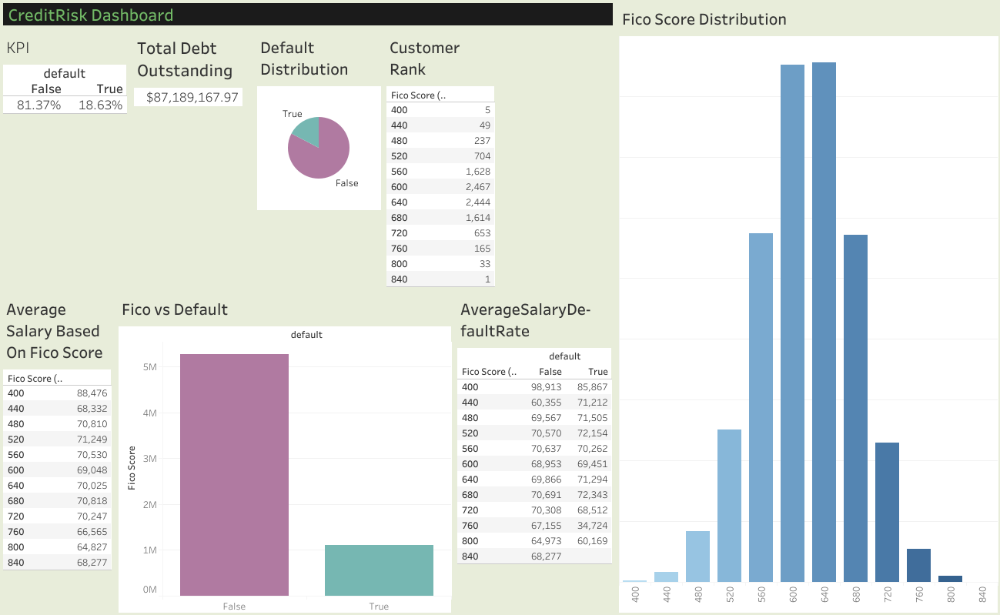

# 📊 Credit Risk Analysis Dashboard (Tableau)

A Tableau dashboard designed to analyze customer credit risk using key financial indicators such as **FICO Score**, **Default Status**, **Debt Outstanding**, and **Average Salary**. The dashboard provides an interactive overview of customer credit behavior, helping financial institutions identify high-risk customers and make informed lending decisions.

---

## 📷 Dashboard Preview



Or 

Visit - https://public.tableau.com/views/CreditRiskDashboard_17852523630110/Dashboard1?:language=en-US&:sid=&:redirect=auth&:display_count=n&:origin=viz_share_link
---

## 🚀 Features

- 📌 Overall Credit Risk KPIs
- 💰 Total Debt Outstanding
- 📉 Default Distribution
- 📈 FICO Score Distribution
- 👥 Customer Count by FICO Score
- 💼 Average Salary Analysis
- 📊 FICO Score vs Default Comparison
- 📋 Average Salary by Default Status

---

## 📊 Dashboard Insights

### KPI Cards
- Displays the percentage of customers who defaulted and those who did not.
- Shows the total outstanding debt across all customers.

### Default Distribution
- Visual representation of customers who have defaulted versus non-defaulted customers.

### FICO Score Distribution
- Histogram showing the distribution of customer FICO scores.

### Customer Rank
- Displays the number of customers within each FICO score range.

### Average Salary Analysis
- Shows the average customer salary for each FICO score.

### FICO Score vs Default
- Compares customer distribution based on FICO score and default status.

### Salary vs Default Rate
- Compares average salary between customers who defaulted and those who did not.

---

## 🛠️ Tools Used

- **Tableau Desktop**
- Tableau Calculated Fields
- Tableau Charts
- Tableau Dashboards

---

## 📂 Dataset

The dashboard is built using a Credit Risk dataset containing:

- Customer ID
- FICO Score
- Default Status
- Debt Outstanding
- Annual Salary

---

## 📈 Key Business Questions Answered

- What percentage of customers have defaulted?
- How are FICO scores distributed?
- Which FICO score ranges contain the most customers?
- How does salary vary across different FICO scores?
- Is there a relationship between FICO score and default rate?
- What is the total outstanding debt?

---

## 🎯 Business Use Cases

- Credit Risk Analysis
- Loan Approval Support
- Banking Analytics
- Financial Decision Making
- Customer Risk Segmentation

---

## 📁 Repository Structure

```
├── Dashboard 1(1).png
├── Credit_Risk_Dashboard.twb
├── Credit_Risk_Dashboard.twbx
├── Dataset.csv
└── README.md
```

---

## 📌 Future Improvements

- Add interactive filters for age, income, and occupation.
- Predict customer default using Machine Learning.
- Add loan amount and repayment analysis.
- Integrate real-time financial data.
- Publish dashboard on Tableau Public.

---

